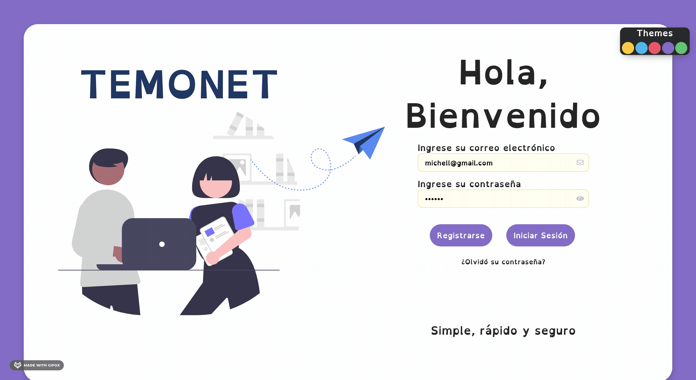

# Temonet

WebApp for children with dyslexia

## Getting Started 🚀

These instructions will get you a copy of the project up and running on your local machine for development and testing purposes. See deployment for notes on how to deploy the project on a live system.



### Prerequisites 📋

You need to install yarn and NodeJS

```
yarn
yarn install
```

### Installing 🔧

A step by step series of examples that tell you how to get a development env running

Say what the step will be

```
git clone https://github.com/richiejoel/temonet-webapp.git
```

And repeat

```
yarn
yarn install
```

End with an example of getting some data out of the system or using it for a little demo

## Running the tests ⚙️

Explain how to run the automated tests for this system

### Break down into end to end tests 🔩

Explain what these tests test and why

```
Give an example
```

### And coding style tests ⌨️

Explain what these tests test and why

```
Give an example
```

## Deployment 📦

Add additional notes about how to deploy this on a live system

## Built With 🛠️

- [React](https://reactjs.org/) - The web framework used
- [SASS](https://sass-lang.com/) - CSS preprocessor
- [Styled Components](https://styled-components.com/) - CSS framework

## Contributing 🖇️

Please read [CONTRIBUTING.md](https://gist.github.com/PurpleBooth/b24679402957c63ec426) for details on our code of conduct, and the process for submitting pull requests to us.

## Versioning 📌

We use [SemVer](http://semver.org/) for versioning. For the versions available, see the [tags on this repository](https://github.com/your/project/tags).

## Authors ✒️

- **Richard Joel Garcia** - _Initial work_ - [richiejoel](https://github.com/richiejoel)

See also the list of [contributors](https://github.com/richiejoel) who participated in this project.

## License 📄

This project is licensed under the MIT License - see the [LICENSE.md](LICENSE.md) file for details

## Acknowledgments 🎁

- Hat tip to anyone whose code was used
- Inspiration
- etc

⌨️ with ❤️ by [richiejoel](https://github.com/richiejoel) 😊
